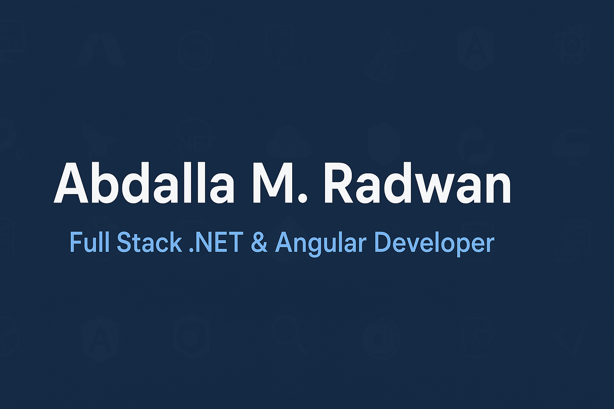

<!-- Banner -->

# 👋 Abdalla M. Radwan
**Full Stack .NET & Angular Developer**  
📍 Cairo, Egypt · 📧 amohamed102000@gmail.com  

---

## 🧑‍💻 About Me
I’m a Full Stack .NET & Angular Developer with hands-on experience in building scalable and efficient web applications using **ASP.NET Core**, **Angular**, and **SQL Server**.  
I recently completed the **Full Stack .NET Trainee program at ITI** and contributed to projects such as **Blue Horizon**, **ITI Exam System**, and **FitVerse**.

---

## 🛠 Skills & Technologies

### 🔹 Programming Languages & Principles

### 🔹 Backend Development

### 🔹 Frontend Development

### 🔹 Database & BI

### 🔹 Tools & Platforms

### 🔹 Soft Skills

---

## 🚀 Featured Projects

- **[Blue Horizon](#)** — Tourist Village Rental Platform (Full Stack .NET & Angular).  
  _Features_: Accommodation booking, user authentication, responsive UI.

- **[ITI Exam System](#)** — Online Examination Platform (.NET 9 Web API & Angular).  
  _Features_: Exam creation, student portal, results management.

- **[FitVerse](#)** — Online Clothing Store (Full Stack .NET & Angular).  
  _Features_: Product catalog, shopping cart, order management.

> 📌 _More details and code available in the repositories._

---

## 📊 GitHub Stats

## 🔥 Most Used Languages

---

## 📬 Contact
- **Email:** amohamed102000@gmail.com  
- **LinkedIn:** [linkedin.com/in/abdallamradwan](https://www.linkedin.com/in/abdallamradwan)  
- **GitHub:** [github.com/abdallamohamed](https://github.com/abdallamohamed)

---
💡 _Actively seeking Full Stack .NET & Angular Developer opportunities — open to relocation and remote work._
